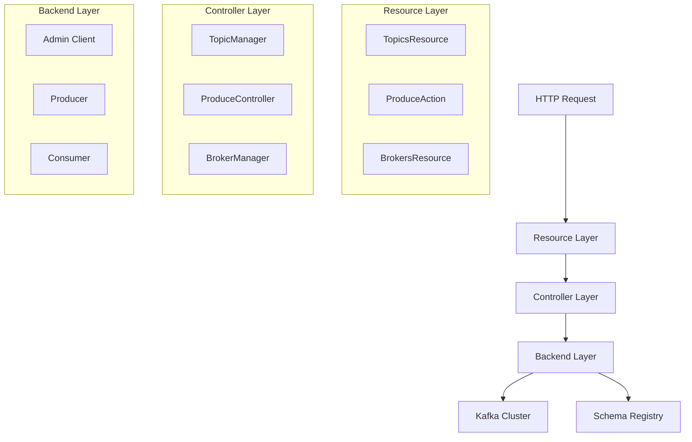
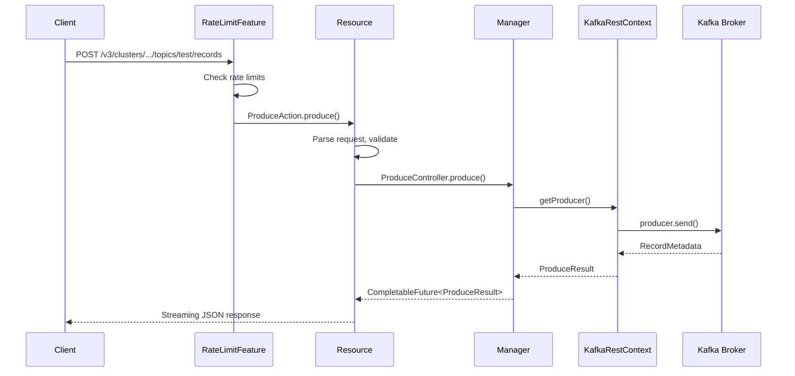

# Understanding Kafka REST Proxy: Architecture and Core Concepts

**Series:** Kafka REST Proxy Deep Dive | **Part 1 of 6**
**Analysis Commit:** `28ae7f33556978fa8ee59bab75b27301d1222622`

## What You'll Learn

- How Kafka REST Proxy is architected as a 3-tier application
- The role of HK2 dependency injection in organizing the codebase
- How requests flow from HTTP endpoints to Kafka
- The design philosophy behind V2 and V3 APIs

## Introduction

Kafka REST Proxy provides a RESTful interface to Apache Kafka, enabling applications to produce and consume messages without native Kafka clients. This is particularly valuable for:

- **Frontend applications** that can't run JVM-based Kafka clients
- **Scripting and automation** where native clients are overkill
- **Legacy system integration** where adding Kafka dependencies is difficult

In this post, we'll explore the architecture that makes this possible and understand the core abstractions that organize the ~32,000 lines of production code.

## Architecture Overview

REST Proxy follows a classic **3-tier layered architecture** with explicit dependency injection:



### Why This Pattern?

The layered architecture was chosen over alternatives like hexagonal architecture or microservices for good reasons:

**Trade-offs Made:**
| Chose | Over | Rationale |
|-------|------|-----------|
| Layers | Hexagonal ports/adapters | Simpler mental model for REST-to-Kafka translation |
| Monolith | Microservices | Single deployment unit, no inter-service latency |
| HK2 DI | Spring | Lighter weight, better Jersey integration |

The pattern fits the problem domain well: REST Proxy is fundamentally a translation layer, and the 3-tier model naturally separates HTTP concerns, business logic, and Kafka integration.

## Entry Points

Let's trace how a request enters the system. The main class is surprisingly simple:

```java
// KafkaRestMain.java:29
// https://github.com/confluentinc/kafka-rest/blob/28ae7f33556978fa8ee59bab75b27301d1222622/kafka-rest/src/main/java/io/confluent/kafkarest/KafkaRestMain.java#L29
public class KafkaRestMain {
  public static void main(String[] args) {
    try {
      KafkaRestConfig config = new KafkaRestConfig(args.length > 0 ? args[0] : null);
      KafkaRestApplication app = new KafkaRestApplication(config);
      app.start();
      app.join();
    } catch (Exception e) {
      log.error("Server died unexpectedly: ", e);
      System.exit(1);
    }
  }
}
```

The real setup happens in `KafkaRestApplication.setupResources()`:

```java
// KafkaRestApplication.java:152-166
// https://github.com/confluentinc/kafka-rest/blob/28ae7f33556978fa8ee59bab75b27301d1222622/kafka-rest/src/main/java/io/confluent/kafkarest/KafkaRestApplication.java#L152-L166
@Override
public void setupResources(Configurable<?> config, KafkaRestConfig appConfig) {
  config.register(new BackendsModule());      // Kafka/SR clients
  config.register(new ConfigModule(appConfig)); // Configuration bindings
  config.register(new ControllersModule());    // Business logic
  config.register(new ExceptionsModule());     // Error handling
  config.register(RateLimitFeature.class);     // Rate limiting
  config.register(new ResourcesFeature(appConfig)); // REST endpoints
  config.register(new ResponseModule());       // Response utilities

  // Extension points for plugins
  for (RestResourceExtension ext : restResourceExtensions) {
    ext.register(config, appConfig);
  }
}
```

This reveals the modular structure: each "Module" is an HK2 `AbstractBinder` that registers related components.

## Dependency Injection with HK2

HK2 (Hundred Kilobyte Kernel 2) is Jersey's lightweight DI framework. Let's see how it's used in the `ControllersModule`:

```java
// ControllersModule.java
// https://github.com/confluentinc/kafka-rest/blob/28ae7f33556978fa8ee59bab75b27301d1222622/kafka-rest/src/main/java/io/confluent/kafkarest/controllers/ControllersModule.java
public final class ControllersModule extends AbstractBinder {
  @Override
  protected void configure() {
    bind(TopicManagerImpl.class).to(TopicManager.class);
    bind(BrokerManagerImpl.class).to(BrokerManager.class);
    bind(ProduceControllerImpl.class).to(ProduceController.class);
    // ... 18 total manager bindings
  }
}
```

This approach provides:

1. **Testability** - Mock implementations can be injected in tests
2. **Loose coupling** - Resources depend on interfaces, not implementations
3. **Single source of truth** - All bindings in one place

### Singleton vs Request-Scoped

Understanding lifecycle is crucial for performance:

**Singletons (Application-wide):**
- `Admin` client - Expensive to create
- `Producer<byte[], byte[]>` - Thread-safe, shared
- `KafkaRestContext` - Facade for clients

**Request-Scoped:**
- `UrlFactory` - Generates response URLs per-request
- `Optional<SchemaRegistryClient>` - Per-request auth possible

## The Three Layers

### 1. Resource Layer (REST Endpoints)

Resources are JAX-RS annotated classes that handle HTTP requests:

```java
// TopicsResource.java (V3)
// https://github.com/confluentinc/kafka-rest/blob/28ae7f33556978fa8ee59bab75b27301d1222622/kafka-rest/src/main/java/io/confluent/kafkarest/resources/v3/TopicsResource.java
@Path("/v3/clusters/{clusterId}/topics")
@ResourceName("api.v3.topics.*")
public class TopicsResource {

  @Inject
  public TopicsResource(
      Provider<TopicManager> topicManager,  // Lazy injection
      CrnFactory crnFactory,
      UrlFactory urlFactory) {
    this.topicManager = topicManager;
    // ...
  }

  @GET
  @Produces(MediaType.APPLICATION_JSON)
  @PerformanceMetric("v3.topics.list")  // Automatic metrics
  public void listTopics(
      @Suspended AsyncResponse asyncResponse,  // Async handling
      @PathParam("clusterId") String clusterId) {

    TopicManager manager = topicManager.get();  // Get from Provider
    manager.listTopics(clusterId)
        .thenApply(topics -> /* transform to response */)
        .whenComplete((response, error) -> /* complete async */);
  }
}
```

Key patterns:
- `Provider<T>` for lazy initialization
- `@Suspended AsyncResponse` for non-blocking I/O
- `@PerformanceMetric` for automatic instrumentation
- `@ResourceName` for access control

### 2. Controller Layer (Business Logic)

Controllers implement operations without HTTP concerns:

```java
// ProduceController.java interface
// https://github.com/confluentinc/kafka-rest/blob/28ae7f33556978fa8ee59bab75b27301d1222622/kafka-rest/src/main/java/io/confluent/kafkarest/controllers/ProduceController.java
public interface ProduceController {
  CompletableFuture<ProduceResult> produce(
      String clusterId,
      String topicName,
      Optional<Integer> partitionId,
      Multimap<String, Optional<ByteString>> headers,
      Optional<ByteString> key,
      Optional<ByteString> value,
      Instant timestamp);
}
```

The implementation handles:
- Cluster validation
- Kafka producer interaction
- Result transformation

This separation means the same controller serves both V2 and V3 APIs.

### 3. Backend Layer (External Systems)

The `KafkaRestContext` interface provides access to Kafka clients:

```java
// KafkaRestContext.java
// https://github.com/confluentinc/kafka-rest/blob/28ae7f33556978fa8ee59bab75b27301d1222622/kafka-rest/src/main/java/io/confluent/kafkarest/KafkaRestContext.java
public interface KafkaRestContext {
  KafkaRestConfig getConfig();
  Admin getAdmin();
  Producer<byte[], byte[]> getProducer();
  Consumer<byte[], byte[]> getConsumer(Properties props);
  void shutdown();
}
```

The `DefaultKafkaRestContext` implementation creates clients lazily and manages their lifecycle.

## V2 vs V3 API Design

REST Proxy supports two API versions with different philosophies:

### V2 API (Legacy)

```
GET /topics
POST /topics/{topic}
GET /consumers/{group}/instances/{instance}/records
```

- **Simpler paths** - No cluster ID
- **Consumer groups** - HTTP-based consumption
- **Content-type negotiation** - `application/vnd.kafka.json.v2+json`

### V3 API (Modern)

```
GET /v3/clusters/{clusterId}/topics
POST /v3/clusters/{clusterId}/topics/{topic}/records
GET /v3/clusters/{clusterId}/consumer-groups
```

- **Cluster-scoped** - Supports multi-cluster deployments
- **Richer responses** - HATEOAS-style links
- **Batch operations** - Efficient bulk APIs
- **Consistent JSON** - `application/json` everywhere

The version routing happens in `ResourcesFeature`:

```java
// ResourcesFeature.java
// https://github.com/confluentinc/kafka-rest/blob/28ae7f33556978fa8ee59bab75b27301d1222622/kafka-rest/src/main/java/io/confluent/kafkarest/resources/ResourcesFeature.java
if (config.isV2ApiEnabled()) {
  configurable.register(V2ResourcesFeature.class);
}
if (config.isV3ApiEnabled()) {
  configurable.register(V3ResourcesFeature.class);
}
```

## Request Lifecycle

Let's trace a complete request:



## Error Handling

Errors flow through a versioned exception mapping system:

```java
// ExceptionsModule.java
// https://github.com/confluentinc/kafka-rest/blob/28ae7f33556978fa8ee59bab75b27301d1222622/kafka-rest/src/main/java/io/confluent/kafkarest/exceptions/ExceptionsModule.java
// DelegatingExceptionHandler routes by URI path:
// - /v3/* → V3ExceptionMapper
// - else → V2ExceptionMapper
```

Error codes follow a consistent pattern (from `Errors.java`):
- `404xx` - Not found (topic, partition, consumer)
- `409xx` - Conflicts (already exists, illegal state)
- `422xx` - Validation errors (schema)
- `429xx` - Rate limit exceeded

## Configuration

All 100+ configuration options live in `KafkaRestConfig`:

```java
// KafkaRestConfig.java:67-1488
// https://github.com/confluentinc/kafka-rest/blob/28ae7f33556978fa8ee59bab75b27301d1222622/kafka-rest/src/main/java/io/confluent/kafkarest/KafkaRestConfig.java
public class KafkaRestConfig extends RestConfig {
  public static final String BOOTSTRAP_SERVERS_CONFIG = "bootstrap.servers";
  // ... 100+ more configurations
}
```

Key configuration categories:
- Kafka connection (`bootstrap.servers`, `client.security.protocol`)
- REST server (`listeners`, `port`)
- Schema Registry (`schema.registry.url`)
- Rate limiting (`rate.limit.enable`, `rate.limit.permits.per.sec`)
- API features (`api.v2.enabled`, `api.v3.enabled`)

## Key Takeaways

1. **Layered architecture** fits the translation problem domain well
2. **HK2 DI** provides testability without Spring's weight
3. **Shared controllers** serve both API versions
4. **Async patterns** (CompletableFuture, AsyncResponse) enable non-blocking I/O
5. **Configuration is centralized** in KafkaRestConfig with clear documentation

## What's Next

In Part 2, we'll trace a produce request in detail, seeing how data flows from HTTP to Kafka and how schemas are resolved through the Schema Registry.

---

**Code References:**
- [KafkaRestMain.java](https://github.com/confluentinc/kafka-rest/blob/28ae7f33556978fa8ee59bab75b27301d1222622/kafka-rest/src/main/java/io/confluent/kafkarest/KafkaRestMain.java)
- [KafkaRestApplication.java](https://github.com/confluentinc/kafka-rest/blob/28ae7f33556978fa8ee59bab75b27301d1222622/kafka-rest/src/main/java/io/confluent/kafkarest/KafkaRestApplication.java)
- [ControllersModule.java](https://github.com/confluentinc/kafka-rest/blob/28ae7f33556978fa8ee59bab75b27301d1222622/kafka-rest/src/main/java/io/confluent/kafkarest/controllers/ControllersModule.java)
