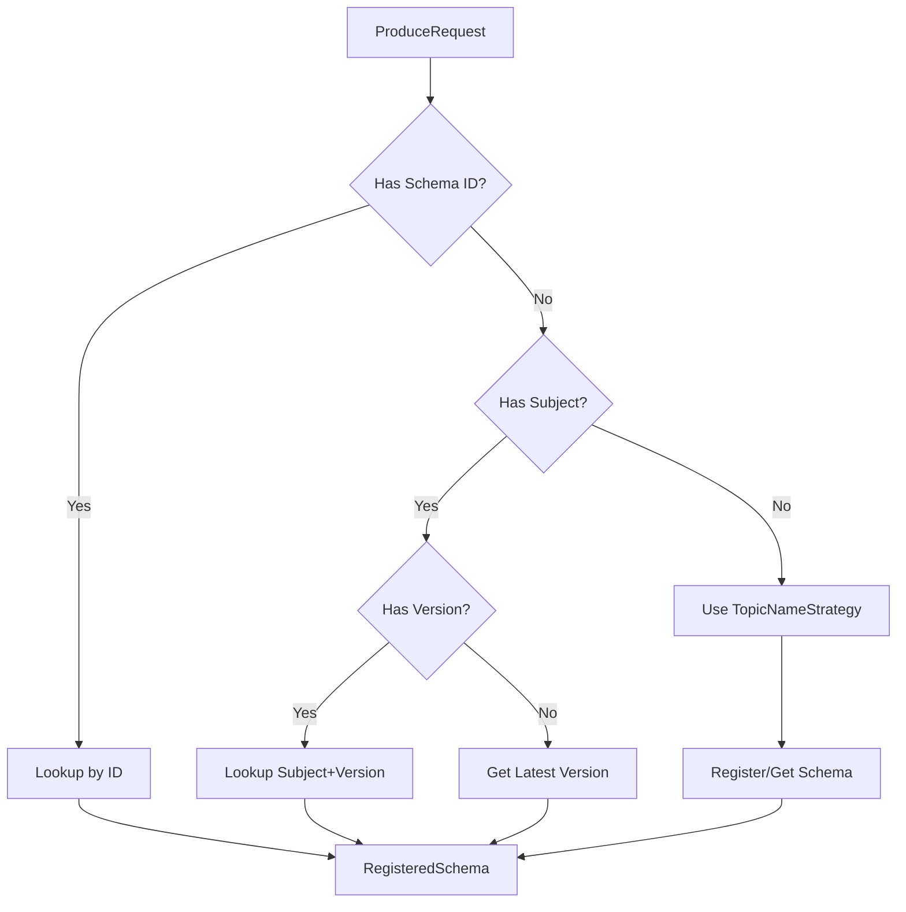
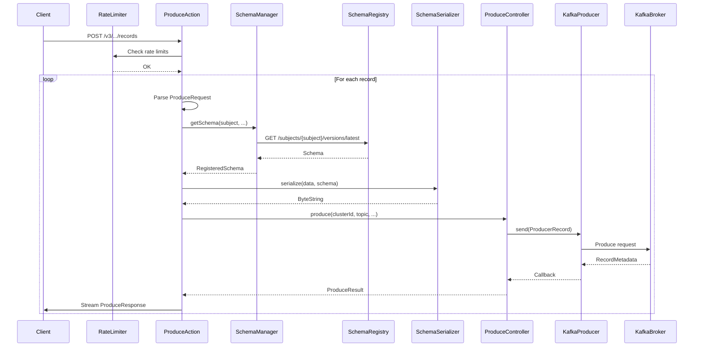

# Deep Dive: The Produce Path in Kafka REST Proxy

**Series:** Kafka REST Proxy Deep Dive | **Part 2 of 6**
**Analysis Commit:** `28ae7f33556978fa8ee59bab75b27301d1222622`

## What You'll Learn

- How a V3 produce request flows from HTTP to Kafka
- Schema resolution and serialization pipeline
- Streaming response handling
- Performance characteristics of the produce path

## Introduction

Producing messages is the most performance-critical operation in Kafka REST Proxy. Every millisecond of latency and every byte of memory matters when you're handling thousands of produce requests per second.

In this post, we'll trace a produce request step-by-step through the codebase, understanding the design decisions that balance flexibility with performance.

## The Produce Request

Let's start with a typical V3 produce request:

```bash
curl -X POST http://localhost:8082/v3/clusters/abc123/topics/orders/records \
  -H "Content-Type: application/json" \
  -d '{"value":{"type":"AVRO","subject":"orders-value","data":{"orderId":123,"amount":99.99}}}'
```

This request will:
1. Pass through rate limiting
2. Parse and validate the JSON
3. Resolve the Avro schema from Schema Registry
4. Serialize the data
5. Send to Kafka
6. Stream the response back

## Entry Point: ProduceAction

The produce endpoint is implemented in `ProduceAction`:

```java
// ProduceAction.java:141
// https://github.com/confluentinc/kafka-rest/blob/28ae7f33556978fa8ee59bab75b27301d1222622/kafka-rest/src/main/java/io/confluent/kafkarest/resources/v3/ProduceAction.java#L141
@Path("/v3/clusters/{clusterId}/topics/{topicName}/records")
@ResourceName("api.v3.produce")
public class ProduceAction {

  @POST
  @Consumes(MediaType.APPLICATION_JSON)
  @Produces(MediaType.APPLICATION_JSON)
  @PerformanceMetric("v3.produce")
  @DoNotRateLimit  // Rate limiting handled specially
  public void produce(
      @Suspended AsyncResponse asyncResponse,
      @PathParam("clusterId") String clusterId,
      @PathParam("topicName") String topicName,
      MappingIterator<ProduceRequest> requests) {
    // ...
  }
}
```

Key observations:
- `@DoNotRateLimit` - Uses custom per-record rate limiting instead
- `MappingIterator<ProduceRequest>` - Enables streaming input
- `@Suspended AsyncResponse` - Non-blocking response

## Rate Limiting Check

Before processing, produce-specific rate limiting is applied:

```java
// ProduceAction.java (conceptual flow)
ProduceRateLimiters rateLimiters = /* injected */;

// Check global limits first (fast path)
rateLimiters.getGlobalCountLimiter().ifPresent(limiter ->
    limiter.rateLimit(1));
rateLimiters.getGlobalBytesLimiter().ifPresent(limiter ->
    limiter.rateLimit(estimatedBytes));

// Then per-cluster limits
rateLimiters.getCountLimiter(clusterId).rateLimit(1);
rateLimiters.getBytesLimiter(clusterId).rateLimit(estimatedBytes);
```

The 4-layer rate limiting system:
1. **Global request count** - Cap total requests/second
2. **Global bytes** - Cap total throughput
3. **Per-cluster request count** - Isolate clusters
4. **Per-cluster bytes** - Fair bandwidth sharing

## Request Parsing

The `MappingIterator` enables streaming JSON parsing:

```java
// JsonStreamMessageBodyReader.java
// https://github.com/confluentinc/kafka-rest/blob/28ae7f33556978fa8ee59bab75b27301d1222622/kafka-rest/src/main/java/io/confluent/kafkarest/response/JsonStreamMessageBodyReader.java
public class JsonStreamMessageBodyReader implements MessageBodyReader<MappingIterator<?>> {
  @Override
  public MappingIterator<?> readFrom(/* params */) {
    return objectMapper
        .readerFor(type)
        .readValues(entityStream);
  }
}
```

This allows processing records before the entire request body is received - important for large batches.

The `ProduceRequest` entity contains:

```java
// ProduceRequest.java (simplified)
@JsonAutoDetect(fieldVisibility = Visibility.ANY)
public abstract class ProduceRequest {
  public abstract Optional<Integer> getPartitionId();
  public abstract Multimap<String, Optional<ByteString>> getHeaders();
  public abstract Optional<ProduceRequestData> getKey();
  public abstract Optional<ProduceRequestData> getValue();
  public abstract Optional<Instant> getTimestamp();
}
```

## Schema Resolution

For schema-based formats (Avro, Protobuf, JSON Schema), we need to resolve the schema:

```java
// SchemaManager interface
// https://github.com/confluentinc/kafka-rest/blob/28ae7f33556978fa8ee59bab75b27301d1222622/kafka-rest/src/main/java/io/confluent/kafkarest/controllers/SchemaManager.java
public interface SchemaManager {
  RegisteredSchema getSchema(
      String topicName,
      Optional<EmbeddedFormat> format,
      Optional<String> subject,
      Optional<Integer> subjectId,
      Optional<Integer> schemaVersion,
      Optional<String> rawSchema,
      boolean isKey);
}
```

The resolution strategy depends on what's provided:
1. **Subject + Version** - Direct lookup
2. **Schema ID** - Direct lookup by ID
3. **Raw Schema** - Register or retrieve
4. **Subject only** - Get latest version



## Serialization Pipeline

Once we have the schema, data is serialized:

```java
// SchemaRecordSerializer (conceptual)
public ByteString serialize(
    EmbeddedFormat format,
    String topicName,
    RegisteredSchema schema,
    JsonNode data,
    boolean isKey) {

  switch (format) {
    case AVRO:
      return avroSerializer.serialize(topicName, schema, data);
    case PROTOBUF:
      return protobufSerializer.serialize(topicName, schema, data);
    case JSONSCHEMA:
      return jsonSchemaSerializer.serialize(topicName, schema, data);
    case JSON:
      return jsonSerializer.serialize(data);
    case BINARY:
      return binarySerializer.serialize(data);
  }
}
```

The serializers use Schema Registry's serializers internally:
- `KafkaAvroSerializer`
- `KafkaProtobufSerializer`
- `KafkaJsonSchemaSerializer`

These serializers:
1. Validate data against schema
2. Encode schema ID in the message
3. Serialize to bytes

## Kafka Producer Interaction

The `ProduceController` sends to Kafka:

```java
// ProduceControllerImpl.java (simplified)
// https://github.com/confluentinc/kafka-rest/blob/28ae7f33556978fa8ee59bab75b27301d1222622/kafka-rest/src/main/java/io/confluent/kafkarest/controllers/ProduceControllerImpl.java
public class ProduceControllerImpl implements ProduceController {

  private final Provider<Producer<byte[], byte[]>> producerProvider;

  @Override
  public CompletableFuture<ProduceResult> produce(
      String clusterId,
      String topicName,
      Optional<Integer> partitionId,
      Multimap<String, Optional<ByteString>> headers,
      Optional<ByteString> key,
      Optional<ByteString> value,
      Instant timestamp) {

    ProducerRecord<byte[], byte[]> record = new ProducerRecord<>(
        topicName,
        partitionId.orElse(null),
        timestamp.toEpochMilli(),
        key.map(ByteString::toByteArray).orElse(null),
        value.map(ByteString::toByteArray).orElse(null),
        toHeaders(headers));

    CompletableFuture<ProduceResult> result = new CompletableFuture<>();

    producerProvider.get().send(record, (metadata, exception) -> {
      if (exception != null) {
        result.completeExceptionally(exception);
      } else {
        result.complete(ProduceResult.create(
            metadata.partition(),
            metadata.offset(),
            Instant.ofEpochMilli(metadata.timestamp()),
            key.map(k -> k.size()).orElse(0),
            value.map(v -> v.size()).orElse(0)));
      }
    });

    return result;
  }
}
```

Key design decisions:
- **Single shared producer** - One `Producer<byte[], byte[]>` for all requests
- **Raw bytes** - Serialization happens before this point
- **CompletableFuture** - Non-blocking callback handling

## Streaming Response

The response streams back as each record is produced:

```java
// ProduceAction.java (simplified response flow)
StreamingOutput streamingOutput = outputStream -> {
  JsonGenerator generator = objectMapper.createGenerator(outputStream);

  while (requests.hasNext()) {
    ProduceRequest request = requests.next();

    CompletableFuture<ProduceResult> future = produceRecord(request);

    ProduceResult result = future.get();  // Wait for this record

    // Write response immediately
    generator.writeObject(ProduceResponse.create(
        clusterId,
        topicName,
        result.getPartitionId(),
        result.getOffset(),
        result.getTimestamp()));
    generator.flush();
  }
};

asyncResponse.resume(Response.ok(streamingOutput).build());
```

This streaming approach:
- **Reduces memory** - Don't buffer all responses
- **Provides progress** - Client sees results as they complete
- **Enables large batches** - No size limits

## Data Flow Diagram



## Error Handling

Errors are converted to error codes and streamed back:

```java
// Errors.java
// https://github.com/confluentinc/kafka-rest/blob/28ae7f33556978fa8ee59bab75b27301d1222622/kafka-rest/src/main/java/io/confluent/kafkarest/Errors.java
public static final int KAFKA_ERROR_ERROR_CODE = 40801;
public static final int KAFKA_RETRIABLE_ERROR_ERROR_CODE = 40801;
public static final int KAFKA_AUTHORIZATION_ERROR_CODE = 40101;
```

Each record gets its own error code in the response:

```json
{"error_code":200,"cluster_id":"abc","topic_name":"orders","partition_id":0,"offset":42}
{"error_code":40801,"message":"Request timed out"}
```

## Performance Characteristics

### Single Producer Design

All requests share one `Producer<byte[], byte[]>`:

```java
// KafkaModule.java (producer factory)
// https://github.com/confluentinc/kafka-rest/blob/28ae7f33556978fa8ee59bab75b27301d1222622/kafka-rest/src/main/java/io/confluent/kafkarest/backends/kafka/KafkaModule.java
@Provides
@Singleton
Producer<byte[], byte[]> provideProducer(KafkaRestConfig config) {
  return new KafkaProducer<>(config.getProducerConfigs());
}
```

**Trade-offs:**
- **Pro:** Low memory footprint, connection reuse
- **Con:** All requests contend for one producer's buffer

**Bottleneck:** Under high load, the producer's internal buffer can become saturated, causing `BufferExhaustedException`.

### Async but Sequential

Records are processed asynchronously but responses are sequential:

```java
// Wait for each record before processing next
ProduceResult result = future.get();
generator.writeObject(response);
```

This ensures ordered responses but limits parallelism.

### Schema Caching

Schema Registry client uses caching:

```java
// Uses CachedSchemaRegistryClient
// Default TTL: 1 hour
```

First request for a schema incurs latency; subsequent requests are cached.

## Optimization Opportunities

Based on this analysis, we can identify improvements:

1. **Producer pooling** - Multiple producers per topic/config
2. **Parallel record processing** - Process records concurrently
3. **Schema pre-fetching** - Warm cache on startup
4. **Batch Kafka sends** - Accumulate records before send

These are explored in the RFCs in this analysis package.

## Batch Produce API

V3 also offers a batch API:

```bash
POST /v3/clusters/{clusterId}/topics/{topic}/records:batch
```

```json
{
  "entries": [
    {"id": "1", "value": {"type": "JSON", "data": "ONE"}},
    {"id": "2", "value": {"type": "JSON", "data": "TWO"}}
  ]
}
```

Response groups successes and failures:

```json
{
  "successes": [
    {"id": "1", "partition_id": 0, "offset": 100}
  ],
  "failures": [
    {"id": "2", "error_code": 400, "message": "Invalid data"}
  ]
}
```

The batch API uses `CompletableFuture.allOf()` to wait for all records, making it less suitable for streaming large payloads but more predictable for fixed-size batches.

## Key Takeaways

1. **Streaming input/output** enables large batches without memory issues
2. **Schema resolution** adds latency but enables validation and evolution
3. **Single shared producer** is simple but can be a bottleneck
4. **4-layer rate limiting** protects both REST Proxy and Kafka
5. **Per-record error codes** maintain partial success semantics

## What's Next

In Part 3, we'll explore the design patterns used throughout the codebase and extract lessons for your own projects.

---

**Code References:**
- [ProduceAction.java](https://github.com/confluentinc/kafka-rest/blob/28ae7f33556978fa8ee59bab75b27301d1222622/kafka-rest/src/main/java/io/confluent/kafkarest/resources/v3/ProduceAction.java)
- [ProduceControllerImpl.java](https://github.com/confluentinc/kafka-rest/blob/28ae7f33556978fa8ee59bab75b27301d1222622/kafka-rest/src/main/java/io/confluent/kafkarest/controllers/ProduceControllerImpl.java)
- [SchemaManager.java](https://github.com/confluentinc/kafka-rest/blob/28ae7f33556978fa8ee59bab75b27301d1222622/kafka-rest/src/main/java/io/confluent/kafkarest/controllers/SchemaManager.java)
