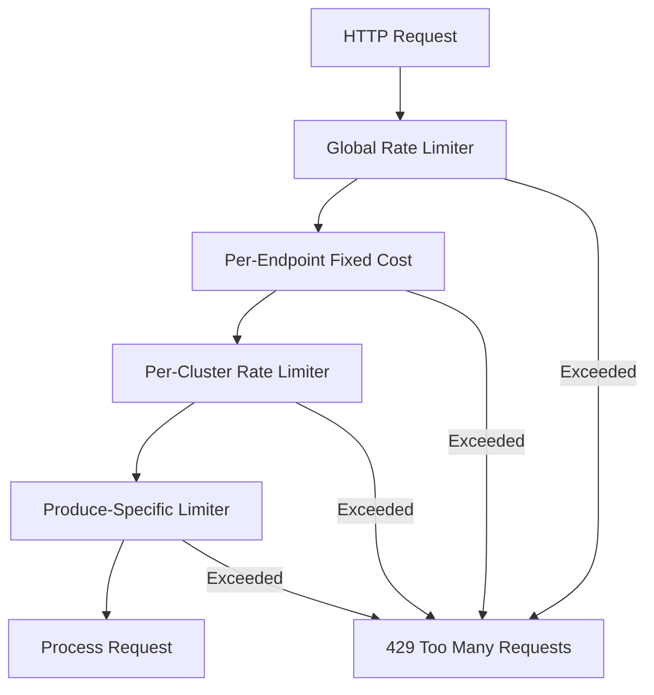

# Rate Limiting and Resilience in Kafka REST Proxy

**Series:** Kafka REST Proxy Deep Dive | **Part 4 of 6**
**Analysis Commit:** `28ae7f33556978fa8ee59bab75b27301d1222622`

## What You'll Learn

- The 4-layer rate limiting architecture
- How pluggable rate limit backends work
- Protection strategies for REST Proxy and Kafka
- Configuring rate limits for your deployment

## Introduction

Kafka REST Proxy sits at a critical juncture: it must protect itself from being overwhelmed while also protecting the Kafka cluster from excessive load. A single misbehaving client shouldn't take down your entire messaging infrastructure.

In this post, we'll explore the sophisticated rate limiting system that achieves this protection.

## The Rate Limiting Architecture

REST Proxy implements a **4-layer rate limiting system**:



Each layer serves a specific purpose:

| Layer | Purpose | Scope |
|-------|---------|-------|
| Global | Cap total server load | All requests |
| Fixed Cost | Weight expensive operations | Per-endpoint |
| Per-Cluster | Isolate tenant clusters | Per-cluster ID |
| Produce-Specific | Control throughput | Produce only |

## Layer 1: Global Rate Limiting

The `RateLimitFeature` applies a global token bucket:

```java
// RateLimitFeature.java
// https://github.com/confluentinc/kafka-rest/blob/28ae7f33556978fa8ee59bab75b27301d1222622/kafka-rest/src/main/java/io/confluent/kafkarest/ratelimit/RateLimitFeature.java
public class RateLimitFeature implements DynamicFeature {

  @Override
  public void configure(ResourceInfo resourceInfo, FeatureContext context) {
    // Skip if @DoNotRateLimit annotation present
    if (resourceInfo.getResourceMethod().isAnnotationPresent(DoNotRateLimit.class)) {
      return;
    }

    context.register(RateLimitRequestFilter.class);
  }
}
```

The filter checks the rate limiter:

```java
// RateLimitRequestFilter.java
public class RateLimitRequestFilter implements ContainerRequestFilter {

  private final RequestRateLimiter rateLimiter;

  @Override
  public void filter(ContainerRequestContext requestContext) {
    rateLimiter.rateLimit(1);  // Cost of 1 per request
  }
}
```

### Configuration

```properties
# Enable global rate limiting
rate.limit.enable=true

# Backend implementation
rate.limit.backend=guava  # or resilience4j

# Permits per second
rate.limit.permits.per.sec=100
```

## Layer 2: Fixed-Cost Rate Limiting

Different endpoints have different costs:

```java
// FixedCostRateLimitFeature.java
// https://github.com/confluentinc/kafka-rest/blob/28ae7f33556978fa8ee59bab75b27301d1222622/kafka-rest/src/main/java/io/confluent/kafkarest/ratelimit/FixedCostRateLimitFeature.java
public class FixedCostRateLimitRequestFilter implements ContainerRequestFilter {

  @Override
  public void filter(ContainerRequestContext requestContext) {
    String endpoint = getEndpointName(requestContext);
    int cost = getCost(endpoint);  // Configured per-endpoint
    rateLimiter.rateLimit(cost);
  }
}
```

### Configuration

```properties
# Default cost per request
rate.limit.default.cost=1

# Custom costs per endpoint (JSON map)
rate.limit.costs={"v3.topics.list": 5, "v3.produce": 10}
```

This allows expensive operations (like listing all topics) to consume more of the rate limit budget.

## Layer 3: Per-Cluster Rate Limiting

For multi-tenant deployments, each cluster has its own limits:

```java
// ProduceRateLimiters.java
// https://github.com/confluentinc/kafka-rest/blob/28ae7f33556978fa8ee59bab75b27301d1222622/kafka-rest/src/main/java/io/confluent/kafkarest/resources/v3/ProduceRateLimiters.java
public class ProduceRateLimiters {

  private final LoadingCache<String, RequestRateLimiter> countLimiters;
  private final LoadingCache<String, RequestRateLimiter> bytesLimiters;

  public RequestRateLimiter getCountLimiter(String clusterId) {
    return countLimiters.getUnchecked(clusterId);
  }

  public RequestRateLimiter getBytesLimiter(String clusterId) {
    return bytesLimiters.getUnchecked(clusterId);
  }
}
```

The cache creates rate limiters on-demand per cluster ID, with a 1-hour TTL.

### Configuration

```properties
# Per-cluster request limits
api.v3.produce.max.requests.per.second=100

# Per-cluster byte limits
api.v3.produce.max.bytes.per.second=10485760  # 10 MB/s

# Cache expiry
api.v3.produce.rate.limit.cache.expiry.ms=3600000  # 1 hour
```

## Layer 4: Produce-Specific Rate Limiting

The produce path has the most sophisticated limiting:

```java
// ProduceAction.java (conceptual)
public void produce(...) {
  // Global limits (fast path)
  globalCountLimiter.ifPresent(l -> l.rateLimit(1));
  globalBytesLimiter.ifPresent(l -> l.rateLimit(bytes));

  // Per-cluster limits
  countLimiter.rateLimit(clusterId, 1);
  bytesLimiter.rateLimit(clusterId, bytes);

  // Proceed with produce
  // ...
}
```

### Configuration

```properties
# Enable produce rate limiting
api.v3.produce.rate.limit.enabled=true

# Global limits (all clusters combined)
api.v3.produce.max.requests.global.per.second=1000
api.v3.produce.max.bytes.global.per.second=104857600  # 100 MB/s

# Per-cluster limits
api.v3.produce.max.requests.per.second=100
api.v3.produce.max.bytes.per.second=10485760  # 10 MB/s
```

## Pluggable Rate Limit Backends

The rate limiting algorithm is pluggable:

```java
// RateLimitBackend.java
// https://github.com/confluentinc/kafka-rest/blob/28ae7f33556978fa8ee59bab75b27301d1222622/kafka-rest/src/main/java/io/confluent/kafkarest/ratelimit/RateLimitBackend.java
public interface RateLimitBackend {
  void rateLimit(int cost);
}
```

### Guava Implementation (Default)

```java
// GuavaRateLimiter.java
public class GuavaRateLimiter implements RateLimitBackend {

  private final RateLimiter rateLimiter;

  public GuavaRateLimiter(double permitsPerSecond) {
    this.rateLimiter = RateLimiter.create(permitsPerSecond);
  }

  @Override
  public void rateLimit(int cost) {
    if (!rateLimiter.tryAcquire(cost)) {
      throw new RateLimitExceededException();
    }
  }
}
```

**Characteristics:**
- Token bucket algorithm
- Smooth burst handling
- No distributed coordination
- Memory-only state

### Resilience4J Implementation

```java
// Resilience4JRateLimiter.java
public class Resilience4JRateLimiter implements RateLimitBackend {

  private final io.github.resilience4j.ratelimiter.RateLimiter rateLimiter;

  @Override
  public void rateLimit(int cost) {
    if (!rateLimiter.acquirePermission(cost)) {
      throw new RateLimitExceededException();
    }
  }
}
```

**Characteristics:**
- Fixed window + permits
- Configurable timeout
- Metrics integration
- Event publishing

### Choosing a Backend

| Criteria | Guava | Resilience4J |
|----------|-------|--------------|
| Algorithm | Token bucket | Fixed window |
| Burst handling | Smooth | Strict |
| Metrics | None | Built-in |
| Memory | Lower | Higher |

## Rate Limit Exceptions

When limits are exceeded:

```java
// RateLimitExceededException.java
// https://github.com/confluentinc/kafka-rest/blob/28ae7f33556978fa8ee59bab75b27301d1222622/kafka-rest/src/main/java/io/confluent/kafkarest/ratelimit/RateLimitExceededException.java
public class RateLimitExceededException extends RuntimeException {
  // Maps to HTTP 429 Too Many Requests
}

// Performance optimization
public class StacklessRateLimitExceededException extends RateLimitExceededException {
  @Override
  public synchronized Throwable fillInStackTrace() {
    return this;  // Skip stack trace capture
  }
}
```

The stackless variant is used because rate limit exceptions are common and stack traces are expensive.

## @DoNotRateLimit Annotation

Some operations opt out of rate limiting:

```java
// ProduceAction.java
@POST
@DoNotRateLimit  // Uses custom produce rate limiting instead
public void produce(...) {
  // ...
}
```

This is used when:
- Operation has custom rate limiting
- Operation must always succeed (health checks)
- Rate limiting happens at a different level

## Protecting Kafka

Beyond rate limiting, REST Proxy protects Kafka through:

### 1. Request Size Limits

```properties
# Maximum request body size
api.v3.produce.request.size.limit.max.bytes=67108864  # 64 MB
```

```java
// JsonStreamMessageBodyReader.java
if (contentLength > maxBytes) {
  throw new BadRequestException("Request too large");
}
```

### 2. Batch Size Limits

```properties
# Maximum records per batch
api.v3.produce.batch.maximum.entries=50
```

### 3. Connection Timeouts

```properties
# Producer timeout
producer.request.timeout.ms=30000

# Admin client timeout
client.request.timeout.ms=30000
```

## Monitoring Rate Limits

To understand rate limiting behavior:

### 1. Metrics

REST Proxy exposes metrics for rate limit events (when using Resilience4J).

### 2. Logging

```java
// Custom request logging includes error codes
// CustomLogRequestAttributes.REST_ERROR_CODE = "rest.error.code"
```

### 3. Response Headers

When rate limited, clients receive:

```
HTTP/1.1 429 Too Many Requests
Content-Type: application/json

{"error_code": 42901, "message": "Rate limit exceeded"}
```

## Configuration Recommendations

### Low-Traffic Deployment

```properties
rate.limit.enable=true
rate.limit.permits.per.sec=50
api.v3.produce.rate.limit.enabled=false
```

### High-Traffic Deployment

```properties
rate.limit.enable=true
rate.limit.backend=guava
rate.limit.permits.per.sec=1000

api.v3.produce.rate.limit.enabled=true
api.v3.produce.max.requests.global.per.second=5000
api.v3.produce.max.bytes.global.per.second=524288000  # 500 MB/s
api.v3.produce.max.requests.per.second=500
api.v3.produce.max.bytes.per.second=52428800  # 50 MB/s
```

### Multi-Tenant Deployment

```properties
# Per-cluster isolation
api.v3.produce.rate.limit.enabled=true
api.v3.produce.max.requests.per.second=100
api.v3.produce.max.bytes.per.second=10485760  # 10 MB/s

# Generous global limit
api.v3.produce.max.requests.global.per.second=10000
api.v3.produce.max.bytes.global.per.second=1073741824  # 1 GB/s
```

## Limitations and Improvements

### Current Limitations

1. **Memory-only state** - No distributed rate limiting
2. **No client identification** - Limits apply to all clients equally
3. **No adaptive limiting** - Fixed configuration

### Potential Improvements

1. **Redis backend** - Distributed rate limiting across instances
2. **Client-aware limits** - Per-client or per-API-key limits
3. **Adaptive throttling** - Adjust limits based on backend health

These are explored in the RFCs in this analysis package.

## Key Takeaways

1. **4-layer rate limiting** provides defense in depth
2. **Pluggable backends** allow algorithm selection
3. **Per-cluster limits** enable multi-tenant isolation
4. **Stackless exceptions** optimize for common case
5. **@DoNotRateLimit** enables custom limiting strategies

## What's Next

In Part 5, we'll explore the extension points and integration patterns that allow customization of REST Proxy.

---

**Code References:**
- [RateLimitFeature.java](https://github.com/confluentinc/kafka-rest/blob/28ae7f33556978fa8ee59bab75b27301d1222622/kafka-rest/src/main/java/io/confluent/kafkarest/ratelimit/RateLimitFeature.java)
- [ProduceRateLimiters.java](https://github.com/confluentinc/kafka-rest/blob/28ae7f33556978fa8ee59bab75b27301d1222622/kafka-rest/src/main/java/io/confluent/kafkarest/resources/v3/ProduceRateLimiters.java)
- [GuavaRateLimiter.java](https://github.com/confluentinc/kafka-rest/blob/28ae7f33556978fa8ee59bab75b27301d1222622/kafka-rest/src/main/java/io/confluent/kafkarest/ratelimit/GuavaRateLimiter.java)
