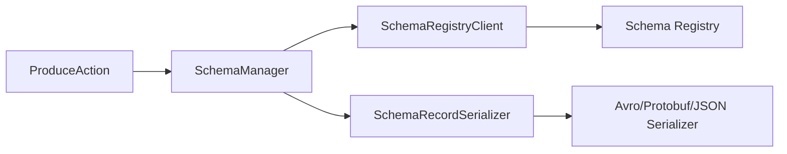

# Extending and Integrating Kafka REST Proxy

**Series:** Kafka REST Proxy Deep Dive | **Part 5 of 6**
**Analysis Commit:** `28ae7f33556978fa8ee59bab75b27301d1222622`

## What You'll Learn

- How to use the RestResourceExtension plugin system
- Schema Registry integration patterns
- Security extension architecture
- Building custom integrations

## Introduction

Kafka REST Proxy is designed to be extended. Whether you need custom authentication, additional endpoints, or specialized serialization, the extension system provides hooks without modifying core code.

In this post, we'll explore these extension points and how to use them effectively.

## The RestResourceExtension Interface

The primary extension mechanism:

```java
// RestResourceExtension.java
// https://github.com/confluentinc/kafka-rest/blob/28ae7f33556978fa8ee59bab75b27301d1222622/kafka-rest/src/main/java/io/confluent/kafkarest/extension/RestResourceExtension.java
public interface RestResourceExtension extends Closeable {

  /**
   * Register resources, providers, and features.
   * Called during application startup.
   */
  void register(Configurable<?> config, KafkaRestConfig appConfig);

  /**
   * Clean up resources.
   * Called during application shutdown.
   */
  default void clean() {}
}
```

### Configuration

Extensions are discovered via configuration:

```properties
rest.extension.classes=com.example.MyExtension,com.example.AnotherExtension
```

### Lifecycle

```java
// KafkaRestApplication.java
public KafkaRestApplication(KafkaRestConfig config, ...) {
  // Load extensions from configuration
  restResourceExtensions = config.getConfiguredInstances(
      "rest.extension.classes",
      RestResourceExtension.class);
}

@Override
public void setupResources(Configurable<?> config, KafkaRestConfig appConfig) {
  // ... register core modules ...

  // Register each extension
  for (RestResourceExtension ext : restResourceExtensions) {
    ext.register(config, appConfig);
  }
}

@Override
public void onShutdown() {
  // Cleanup extensions
  for (RestResourceExtension ext : restResourceExtensions) {
    ext.clean();
  }
}
```

## Building an Extension

### Example: Custom Health Check

```java
public class HealthCheckExtension implements RestResourceExtension {

  @Override
  public void register(Configurable<?> config, KafkaRestConfig appConfig) {
    // Register the health check resource
    config.register(HealthCheckResource.class);

    // Register supporting providers
    config.register(HealthCheckModule.class);
  }

  @Override
  public void clean() {
    // No cleanup needed
  }
}

@Path("/health")
public class HealthCheckResource {

  @Inject
  private Provider<Admin> adminProvider;

  @GET
  @Produces(MediaType.APPLICATION_JSON)
  public Response healthCheck() {
    try {
      Admin admin = adminProvider.get();
      admin.describeCluster().clusterId().get(5, TimeUnit.SECONDS);
      return Response.ok(Map.of("status", "healthy")).build();
    } catch (Exception e) {
      return Response.status(503)
          .entity(Map.of("status", "unhealthy", "error", e.getMessage()))
          .build();
    }
  }
}
```

### Example: Request Logging

```java
public class RequestLoggingExtension implements RestResourceExtension {

  @Override
  public void register(Configurable<?> config, KafkaRestConfig appConfig) {
    config.register(RequestLoggingFilter.class);
  }
}

@Provider
@PreMatching
public class RequestLoggingFilter implements ContainerRequestFilter {

  private static final Logger log = LoggerFactory.getLogger(RequestLoggingFilter.class);

  @Override
  public void filter(ContainerRequestContext requestContext) {
    log.info("Request: {} {} from {}",
        requestContext.getMethod(),
        requestContext.getUriInfo().getPath(),
        requestContext.getHeaderString("X-Forwarded-For"));
  }
}
```

## Schema Registry Integration

REST Proxy integrates deeply with Schema Registry for data validation and serialization.

### Architecture



### SchemaManager Interface

```java
// SchemaManager.java
// https://github.com/confluentinc/kafka-rest/blob/28ae7f33556978fa8ee59bab75b27301d1222622/kafka-rest/src/main/java/io/confluent/kafkarest/controllers/SchemaManager.java
public interface SchemaManager {

  RegisteredSchema getSchema(
      String topicName,
      Optional<EmbeddedFormat> format,
      Optional<String> subject,
      Optional<Integer> schemaId,
      Optional<Integer> schemaVersion,
      Optional<String> rawSchema,
      boolean isKey);
}
```

### Client Configuration

```properties
# Schema Registry URL
schema.registry.url=http://localhost:8081

# Authentication (if required)
basic.auth.credentials.source=USER_INFO
basic.auth.user.info=user:password

# SSL (if required)
schema.registry.ssl.truststore.location=/path/to/truststore.jks
schema.registry.ssl.truststore.password=secret
```

### Subject Name Strategies

Control how schema subjects are named:

```properties
# Key subject strategy
key.subject.name.strategy=io.confluent.kafka.serializers.subject.TopicNameStrategy

# Value subject strategy
value.subject.name.strategy=io.confluent.kafka.serializers.subject.TopicNameStrategy
```

**Available Strategies:**
- `TopicNameStrategy` - `{topic}-key`, `{topic}-value`
- `RecordNameStrategy` - `{record.name}`
- `TopicRecordNameStrategy` - `{topic}-{record.name}`

### Caching

Schema Registry client uses internal caching:

```java
// CachedSchemaRegistryClient
// Default cache size: 1000 schemas
// Default TTL: 1 hour
```

For high-throughput scenarios, consider pre-warming the cache.

## Security Extensions

Enterprise deployments use security extensions for authentication and authorization.

### The Security Extension Pattern

```java
// Enterprise security extension (conceptual)
public class KafkaRestSecurityResourceExtension implements RestResourceExtension {

  @Override
  public void register(Configurable<?> config, KafkaRestConfig appConfig) {
    // Authentication filter
    config.register(AuthenticationFilter.class);

    // Authorization filter
    config.register(AuthorizationFilter.class);

    // Security context provider
    config.register(SecurityContextModule.class);
  }
}
```

### Warning for Missing Security

REST Proxy warns if security is not configured:

```java
// KafkaRestApplication.java:220-240
private void securityResourceExtensionWarning(KafkaRestConfig config) {
  List<String> extensions = config.getList("rest.extension.classes");
  for (Object extension : extensions) {
    if (extension.toString().contains("kafkarestsecurityresourceextension")) {
      return;  // Security configured
    }
  }
  log.warn("REST security extensions are not configured. "
      + "If an Enterprise license is expected...");
}
```

## Resource Access Control

Control which endpoints are accessible:

### Allowlist

```properties
# Only allow these endpoints
api.endpoints.allowlist=api.v3.topics.list,api.v3.produce
```

### Blocklist

```properties
# Block these endpoints
api.endpoints.blocklist=api.v3.acls.*,api.v2.*
```

### @ResourceName Annotation

Resources declare their names for access control:

```java
// TopicsResource.java
@Path("/v3/clusters/{clusterId}/topics")
@ResourceName("api.v3.topics.*")  // Matches allowlist/blocklist
public class TopicsResource {
  // ...
}
```

### Implementation

```java
// ResourceAccesslistFeature.java
// https://github.com/confluentinc/kafka-rest/blob/28ae7f33556978fa8ee59bab75b27301d1222622/kafka-rest/src/main/java/io/confluent/kafkarest/extension/ResourceAccesslistFeature.java
public class ResourceAccesslistFeature implements DynamicFeature {

  @Override
  public void configure(ResourceInfo resourceInfo, FeatureContext context) {
    String resourceName = getResourceName(resourceInfo);

    if (isBlocked(resourceName) || !isAllowed(resourceName)) {
      context.register(BlockedResourceFilter.class);
    }
  }
}
```

## Custom Converters

Add support for custom types in path/query parameters:

### Enum Converter

```java
// EnumConverterProvider.java
// https://github.com/confluentinc/kafka-rest/blob/28ae7f33556978fa8ee59bab75b27301d1222622/kafka-rest/src/main/java/io/confluent/kafkarest/extension/EnumConverterProvider.java
@Provider
public class EnumConverterProvider implements ParamConverterProvider {

  @Override
  public <T> ParamConverter<T> getConverter(Class<T> rawType, ...) {
    if (!rawType.isEnum()) {
      return null;
    }

    return new ParamConverter<T>() {
      @Override
      public T fromString(String value) {
        // Convert using @JsonValue if present
        return findEnumConstant(rawType, value);
      }

      @Override
      public String toString(T value) {
        return getJsonValue((Enum<?>) value);
      }
    };
  }
}
```

### Instant Converter

```java
// InstantConverterProvider.java
// https://github.com/confluentinc/kafka-rest/blob/28ae7f33556978fa8ee59bab75b27301d1222622/kafka-rest/src/main/java/io/confluent/kafkarest/extension/InstantConverterProvider.java
@Provider
public class InstantConverterProvider implements ParamConverterProvider {

  @Override
  public <T> ParamConverter<T> getConverter(Class<T> rawType, ...) {
    if (rawType != Instant.class) {
      return null;
    }

    return (ParamConverter<T>) new ParamConverter<Instant>() {
      @Override
      public Instant fromString(String value) {
        return Instant.parse(value);  // ISO-8601
      }

      @Override
      public String toString(Instant value) {
        return value.toString();
      }
    };
  }
}
```

## Integration Patterns

### Pattern 1: Sidecar Deployment

```
┌─────────────────┐     ┌─────────────────┐
│  Application    │────▶│  REST Proxy     │────▶ Kafka
│  (any language) │     │  (localhost)    │
└─────────────────┘     └─────────────────┘
```

Benefits:
- Application and proxy scale together
- Low latency (localhost)
- Simple networking

### Pattern 2: Gateway Deployment

```
┌─────────────┐     ┌─────────────┐     ┌─────────────┐
│  App 1      │────▶│             │     │             │
├─────────────┤     │   REST      │────▶│   Kafka     │
│  App 2      │────▶│   Proxy     │     │   Cluster   │
├─────────────┤     │   (Pool)    │     │             │
│  App 3      │────▶│             │     │             │
└─────────────┘     └─────────────┘     └─────────────┘
```

Benefits:
- Centralized management
- Connection pooling
- Rate limiting across clients

### Pattern 3: Multi-Cluster

```
┌─────────────────┐
│   REST Proxy    │
│  (Multi-tenant) │
└────────┬────────┘
         │
    ┌────┴────┐
    │         │
    ▼         ▼
┌───────┐ ┌───────┐
│Kafka A│ │Kafka B│
└───────┘ └───────┘
```

V3 API supports this with cluster ID in paths:
- `/v3/clusters/cluster-a/topics`
- `/v3/clusters/cluster-b/topics`

## Common Integration Challenges

### Challenge 1: Connection Management

REST Proxy maintains:
- One Admin client (singleton)
- One Producer (singleton)
- Multiple Consumers (per consumer instance)

For high availability, run multiple REST Proxy instances behind a load balancer.

### Challenge 2: Schema Evolution

When schemas evolve:
1. Register new schema version in Schema Registry
2. REST Proxy auto-detects via cache refresh (1 hour TTL)
3. For immediate update, restart REST Proxy

### Challenge 3: Error Mapping

REST Proxy translates Kafka errors to HTTP:

| Kafka Error | HTTP Status | Error Code |
|-------------|-------------|------------|
| TOPIC_NOT_FOUND | 404 | 40401 |
| AUTHORIZATION | 403 | 40101 |
| TIMEOUT | 408 | 40801 |
| LEADER_NOT_AVAILABLE | 503 | 50301 |

## Best Practices for Extensions

1. **Keep extensions focused** - One responsibility per extension
2. **Use proper cleanup** - Implement `clean()` for resources
3. **Respect configuration** - Read from KafkaRestConfig
4. **Handle errors gracefully** - Don't crash the server
5. **Document thoroughly** - Future maintainers will thank you

## Key Takeaways

1. **RestResourceExtension** is the primary plugin mechanism
2. **Schema Registry** provides validation and schema evolution
3. **Security extensions** enable enterprise authentication
4. **Access control** via allowlist/blocklist for fine-grained API control
5. **Multiple deployment patterns** suit different use cases

## What's Next

In Part 6, we'll analyze performance characteristics and identify optimization opportunities.

---

**Code References:**
- [RestResourceExtension.java](https://github.com/confluentinc/kafka-rest/blob/28ae7f33556978fa8ee59bab75b27301d1222622/kafka-rest/src/main/java/io/confluent/kafkarest/extension/RestResourceExtension.java)
- [ResourceAccesslistFeature.java](https://github.com/confluentinc/kafka-rest/blob/28ae7f33556978fa8ee59bab75b27301d1222622/kafka-rest/src/main/java/io/confluent/kafkarest/extension/ResourceAccesslistFeature.java)
- [EnumConverterProvider.java](https://github.com/confluentinc/kafka-rest/blob/28ae7f33556978fa8ee59bab75b27301d1222622/kafka-rest/src/main/java/io/confluent/kafkarest/extension/EnumConverterProvider.java)
