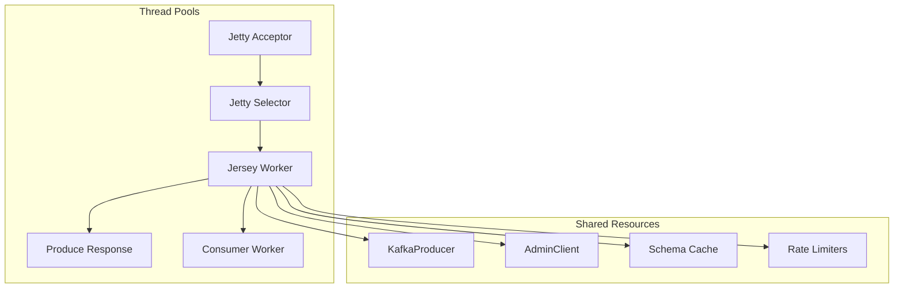

# Performance Analysis and Optimization in Kafka REST Proxy

**Series:** Kafka REST Proxy Deep Dive | **Part 6 of 6**
**Analysis Commit:** `28ae7f33556978fa8ee59bab75b27301d1222622`

## What You'll Learn

- Performance characteristics of REST Proxy components
- Identified bottlenecks and their causes
- Optimization opportunities with trade-offs
- Tuning recommendations for different workloads

## Introduction

Performance in Kafka REST Proxy matters. Every millisecond of latency translates to slower applications. Every inefficiency in resource usage means higher costs. In this final post, we'll analyze the performance characteristics and identify improvement opportunities.

## Performance Architecture Overview



## Producer Performance Analysis

### Current Design: Single Shared Producer

```java
// KafkaModule.java
// https://github.com/confluentinc/kafka-rest/blob/28ae7f33556978fa8ee59bab75b27301d1222622/kafka-rest/src/main/java/io/confluent/kafkarest/backends/kafka/KafkaModule.java
@Provides
@Singleton
Producer<byte[], byte[]> provideProducer(KafkaRestConfig config) {
  return new KafkaProducer<>(config.getProducerConfigs());
}
```

**Characteristics:**
- One producer handles all requests
- Thread-safe (KafkaProducer is thread-safe)
- Shared buffer memory
- Shared connection pool to brokers

### Bottleneck Analysis

Under high load, the single producer becomes a bottleneck:

1. **Buffer saturation** - `buffer.memory` is shared across all topics
2. **Batch optimization conflict** - Different topics have different optimal batch sizes
3. **Linger conflict** - Trade-off between latency and throughput is global

**Evidence:**
```java
// All produce requests compete for the same producer
producerProvider.get().send(record, callback);
```

### Optimization: Producer Pooling

Instead of one producer, use a pool:

```java
// Proposed design
Map<String, Producer<byte[], byte[]>> producerPool;

Producer<byte[], byte[]> getProducer(String topicName) {
  return producerPool.computeIfAbsent(topicName, t ->
      new KafkaProducer<>(getConfigForTopic(t)));
}
```

**Trade-offs:**
| Aspect | Single Producer | Producer Pool |
|--------|-----------------|---------------|
| Memory | Lower | Higher |
| Connections | Fewer | More |
| Isolation | None | Per-topic |
| Complexity | Simple | Complex |

## Consumer Performance Analysis

### Current Design: Thread Pool with Expiration

```java
// KafkaConsumerManager.java
// https://github.com/confluentinc/kafka-rest/blob/28ae7f33556978fa8ee59bab75b27301d1222622/kafka-rest/src/main/java/io/confluent/kafkarest/v2/KafkaConsumerManager.java
private ExecutorService executor = new ThreadPoolExecutor(
    0,                           // Core size
    consumerThreadPoolSize,      // Max size (default 50)
    60L, TimeUnit.SECONDS,       // Keep alive
    new SynchronousQueue<>()     // No queueing
);
```

**Characteristics:**
- Threads created on-demand
- No queueing (SynchronousQueue)
- 60-second keep-alive
- Default max 50 threads

### Bottleneck Analysis

1. **Lock contention** - ExpirationThread checks consumers every second:

```java
// ExpirationThread runs every 1 second
synchronized (this) {
  for (Entry<ConsumerInstanceId, KafkaConsumerState> entry : consumers.entrySet()) {
    if (entry.getValue().expired(now)) {
      // Remove expired consumer
    }
  }
}
```

2. **Thread creation overhead** - No core threads means cold starts
3. **Memory per consumer** - Each consumer buffers records

### Optimization: Improve Consumer Management

```java
// Proposed improvements
// 1. Use read-write lock instead of synchronized
private final ReadWriteLock consumerLock = new ReentrantReadWriteLock();

// 2. Increase expiration interval
// 3. Use ConcurrentHashMap for lock-free reads
private final ConcurrentHashMap<ConsumerInstanceId, KafkaConsumerState> consumers;
```

## Caching Performance

### Schema Registry Cache

```java
// CachedSchemaRegistryClient
// Default: 1000 schemas, 1-hour TTL
```

**Performance characteristics:**
- Cache hit: ~1ms
- Cache miss: 50-200ms (network call)

### Rate Limiter Cache

```java
// ProduceRateLimiters.java
// https://github.com/confluentinc/kafka-rest/blob/28ae7f33556978fa8ee59bab75b27301d1222622/kafka-rest/src/main/java/io/confluent/kafkarest/resources/v3/ProduceRateLimiters.java
private final LoadingCache<String, RequestRateLimiter> countLimiters =
    CacheBuilder.newBuilder()
        .expireAfterAccess(cacheExpiryMs, TimeUnit.MILLISECONDS)
        .build(new CacheLoader<String, RequestRateLimiter>() {
          @Override
          public RequestRateLimiter load(String clusterId) {
            return rateLimiterFactory.create(...);
          }
        });
```

**Bottleneck:** `getUnchecked()` acquires a lock on cache miss, causing contention under high concurrency.

### Optimization: Reduce Cache Lock Contention

```java
// Proposed: Use Caffeine instead of Guava for better concurrency
private final Cache<String, RequestRateLimiter> countLimiters =
    Caffeine.newBuilder()
        .expireAfterAccess(cacheExpiryMs, TimeUnit.MILLISECONDS)
        .build();
```

Caffeine uses a more sophisticated concurrency model with better performance.

## Thread Pool Analysis

### Produce Response Pool

```java
// V3ResourcesModule.java
@Provides
@Singleton
@ProduceResponseThreadPool
ExecutorService provideProduceResponseThreadPool() {
  return Executors.newFixedThreadPool(
      Runtime.getRuntime().availableProcessors());
}
```

**Tuning considerations:**
- CPU-bound work → availableProcessors is good
- I/O-bound work → consider more threads

### Configuration Recommendations

```properties
# For I/O-heavy workloads
api.v3.produce.response.thread.pool.size=32

# For CPU-heavy workloads (default)
# Uses Runtime.availableProcessors()
```

## Async Pattern Analysis

### Current Pattern: CompletableFuture Chains

```java
// TopicsResource.java
topicManager.get().listTopics(clusterId)
    .thenApply(topics -> transform(topics))
    .thenApply(Response::ok)
    .whenComplete((builder, error) -> {
      asyncResponse.resume(/*...*/);
    });
```

**Performance characteristics:**
- Non-blocking I/O
- Each stage may run on different thread
- Context switching overhead

### Bottleneck: Exception Handling

```java
// Stack traces are expensive
throw new RateLimitExceededException();

// Solution: Stackless exceptions
// RateLimitExceededException.java
public class StacklessRateLimitExceededException extends RateLimitExceededException {
  @Override
  public Throwable fillInStackTrace() {
    return this;  // Skip stack trace
  }
}
```

Stack trace capture can cost 1-10ms per exception. For common exceptions like rate limiting, this adds up.

## Metrics and Observability

### Performance Metrics

```java
// @PerformanceMetric annotation
@GET
@PerformanceMetric("v3.topics.list")
public void listTopics(...) {
  // ...
}
```

Metrics collected:
- Request count
- Latency percentiles
- Error rate

### Optimization: Sample Metrics

For high-throughput deployments, consider sampling:

```properties
# Sample 10% of requests for detailed metrics
metrics.sample.rate=0.1
```

## Memory Usage Analysis

### Key Memory Consumers

| Component | Memory Usage | Tuning |
|-----------|--------------|--------|
| KafkaProducer buffer | `buffer.memory` (32MB default) | Increase for throughput |
| Consumer record buffer | Per-consumer | Limit `max.poll.records` |
| Schema cache | ~1000 schemas | Increase for many schemas |
| Rate limiter cache | Per-cluster | Set reasonable TTL |

### Optimization: Memory Limits

```properties
# Producer buffer
producer.buffer.memory=67108864  # 64MB

# Consumer records
max.poll.records=30  # Default, reduce for lower memory

# JVM heap for integration tests
# pom.xml: -Xmx4g -Xms2g
```

## Performance Testing Approach

### Benchmarking Setup

```bash
# 1. Start REST Proxy with metrics
java -jar kafka-rest-standalone.jar kafka-rest.properties

# 2. Run load test
wrk -t12 -c400 -d30s -s produce.lua http://localhost:8082
```

### Metrics to Collect

1. **Latency** - p50, p95, p99
2. **Throughput** - requests/second
3. **Resource usage** - CPU, memory, connections
4. **Error rate** - 429s, 5xxs

## Optimization Priorities

Based on the analysis, prioritized improvements:

### Quick Wins (< 1 week)

1. **Use stackless exceptions** for rate limits
   - Impact: 10-20% latency reduction on rate-limited requests
   - Effort: 1 day

2. **Increase consumer expiration interval**
   - Impact: Reduced lock contention
   - Effort: Configuration change

3. **Pre-warm schema cache**
   - Impact: Eliminate first-request latency
   - Effort: 2 days

### Strategic (2-4 weeks)

4. **Producer pooling**
   - Impact: 30-50% throughput improvement
   - Effort: 2 weeks

5. **Replace Guava cache with Caffeine**
   - Impact: Better concurrency
   - Effort: 1 week

6. **Read-write lock for consumers**
   - Impact: Reduced contention
   - Effort: 1 week

### Long-term (> 1 month)

7. **Distributed rate limiting**
   - Impact: Multi-instance coordination
   - Effort: 1 month

8. **gRPC interface**
   - Impact: Lower latency for high-performance clients
   - Effort: 2 months

## Configuration Recommendations

### Low-Latency Configuration

```properties
# Producer tuning
producer.linger.ms=0
producer.batch.size=16384
producer.buffer.memory=33554432

# Consumer tuning
consumer.fetch.min.bytes=1
max.poll.records=10

# Rate limiting
rate.limit.enable=false
```

### High-Throughput Configuration

```properties
# Producer tuning
producer.linger.ms=100
producer.batch.size=65536
producer.buffer.memory=134217728  # 128MB
producer.compression.type=lz4

# Consumer tuning
consumer.fetch.min.bytes=1048576  # 1MB
max.poll.records=500

# Rate limiting
rate.limit.enable=true
rate.limit.permits.per.sec=10000
```

### Balanced Configuration

```properties
# Producer tuning
producer.linger.ms=5
producer.batch.size=32768
producer.buffer.memory=67108864  # 64MB

# Consumer tuning
consumer.fetch.min.bytes=1024
max.poll.records=30

# Rate limiting
rate.limit.enable=true
rate.limit.permits.per.sec=1000
```

## Key Takeaways

1. **Single shared producer** is the primary bottleneck under high load
2. **Lock contention** in consumer management affects scalability
3. **Caching** is critical for schema and rate limiter performance
4. **Stackless exceptions** provide significant latency improvement
5. **Configuration tuning** can achieve 2-3x performance difference

## Series Conclusion

Over this 6-part series, we've explored Kafka REST Proxy from architecture to performance. The codebase demonstrates solid engineering practices while leaving room for optimization in specific areas.

Whether you're integrating REST Proxy, contributing to it, or building similar systems, the patterns and insights from this analysis should serve you well.

---

**Code References:**
- [KafkaModule.java](https://github.com/confluentinc/kafka-rest/blob/28ae7f33556978fa8ee59bab75b27301d1222622/kafka-rest/src/main/java/io/confluent/kafkarest/backends/kafka/KafkaModule.java)
- [KafkaConsumerManager.java](https://github.com/confluentinc/kafka-rest/blob/28ae7f33556978fa8ee59bab75b27301d1222622/kafka-rest/src/main/java/io/confluent/kafkarest/v2/KafkaConsumerManager.java)
- [ProduceRateLimiters.java](https://github.com/confluentinc/kafka-rest/blob/28ae7f33556978fa8ee59bab75b27301d1222622/kafka-rest/src/main/java/io/confluent/kafkarest/resources/v3/ProduceRateLimiters.java)
