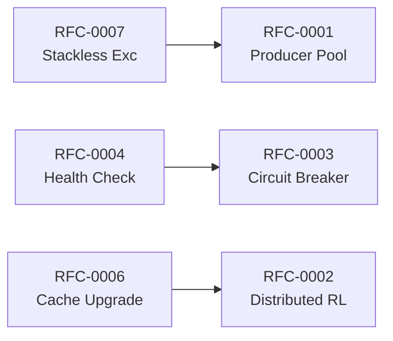

# RFC Prioritization Matrix

**Analysis Commit:** `28ae7f33556978fa8ee59bab75b27301d1222622`

## Overview

This document prioritizes the improvement RFCs based on impact and effort. Use this to plan your implementation roadmap.

## Priority Matrix

```
Impact
  ^
  │
H │  RFC-0003        RFC-0001
I │  Circuit Breaker Producer Pool
G │
H │
  │
M │  RFC-0004        RFC-0005
E │  Health Check    Async Consumer
D │
  │
L │  RFC-0007        RFC-0006
O │  Stackless Exc   Cache Upgrade
W │
  └──────────────────────────────────▶
       LOW          MEDIUM        HIGH
                   Effort
```

## Categorization

### Quick Wins (< 1 week effort, immediate value)

| RFC | Title | Impact | Effort | Priority |
|-----|-------|--------|--------|----------|
| RFC-0007 | Stackless Exceptions | Medium | 2 days | 1 |
| RFC-0004 | Health Check Endpoint | Medium | 3 days | 2 |
| RFC-0006 | Cache Implementation Upgrade | Low-Medium | 4 days | 3 |

### Strategic (2-4 weeks, significant impact)

| RFC | Title | Impact | Effort | Priority |
|-----|-------|--------|--------|----------|
| RFC-0001 | Producer Pooling | High | 3 weeks | 1 |
| RFC-0003 | Circuit Breaker for Schema Registry | High | 2 weeks | 2 |
| RFC-0005 | Async Consumer Operations | Medium-High | 3 weeks | 3 |

### Long-term (> 1 month, architectural changes)

| RFC | Title | Impact | Effort | Priority |
|-----|-------|--------|--------|----------|
| RFC-0002 | Distributed Rate Limiting | High | 6 weeks | 1 |

## Implementation Roadmap

### Phase 1: Foundation (Weeks 1-2)

**Goal:** Quick wins to improve baseline performance

1. **RFC-0007: Stackless Exceptions**
   - 10-20% latency reduction on rate-limited paths
   - Simple change, low risk

2. **RFC-0004: Health Check Endpoint**
   - Enables production monitoring
   - Required for Kubernetes deployments

### Phase 2: Performance (Weeks 3-6)

**Goal:** Address primary bottlenecks

3. **RFC-0001: Producer Pooling**
   - 30-50% throughput improvement
   - Highest impact single change

4. **RFC-0003: Circuit Breaker**
   - Protects against Schema Registry failures
   - Improves resilience

### Phase 3: Scalability (Weeks 7-10)

**Goal:** Multi-instance coordination

5. **RFC-0006: Cache Upgrade**
   - Foundation for better concurrency
   - Prepares for distributed caching

6. **RFC-0005: Async Consumer**
   - Better resource utilization
   - Improved scalability

### Phase 4: Enterprise (Weeks 11+)

**Goal:** Production-grade features

7. **RFC-0002: Distributed Rate Limiting**
   - Multi-instance coordination
   - Required for horizontally-scaled deployments

## Dependencies



## Success Metrics

| RFC | Success Criteria |
|-----|------------------|
| RFC-0001 | 30% throughput increase in benchmarks |
| RFC-0002 | Rate limits enforced across instances |
| RFC-0003 | Zero cascading failures on SR outage |
| RFC-0004 | Kubernetes readiness probes working |
| RFC-0005 | 50% reduction in consumer threads |
| RFC-0006 | 20% reduction in cache contention |
| RFC-0007 | 15% latency reduction on 429 responses |

## Risk Assessment

| RFC | Risk Level | Mitigation |
|-----|------------|------------|
| RFC-0001 | Medium | Feature flag, gradual rollout |
| RFC-0002 | High | Extensive testing, fallback to local |
| RFC-0003 | Low | Configurable, disabled by default |
| RFC-0004 | Low | Read-only endpoint |
| RFC-0005 | Medium | Backward compatible API |
| RFC-0006 | Low | Drop-in replacement |
| RFC-0007 | Low | Internal optimization only |

## Stakeholder Approval Required

| RFC | Approvers |
|-----|-----------|
| RFC-0001 | Performance Team, Architecture |
| RFC-0002 | Architecture, Operations, Security |
| RFC-0003 | Architecture |
| RFC-0004 | Operations |
| RFC-0005 | Architecture |
| RFC-0006 | Performance Team |
| RFC-0007 | Performance Team |
