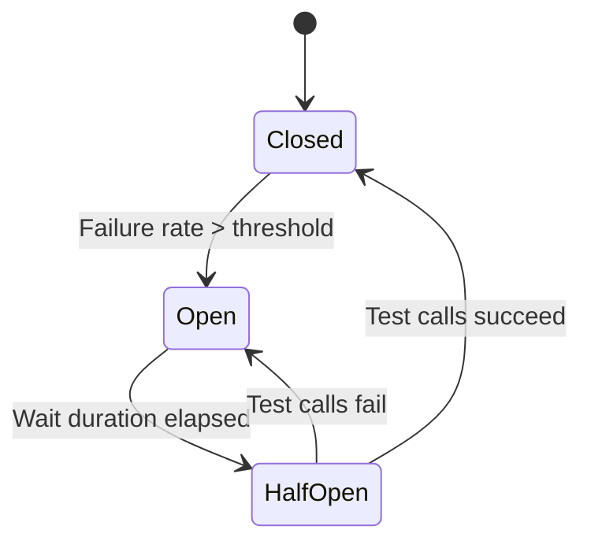

# RFC-0003: Circuit Breaker for Schema Registry

**Status:** Draft
**Author:** Codebase Analysis
**Created:** 2025-11-19
**Analysis Commit:** `28ae7f33556978fa8ee59bab75b27301d1222622`

## Summary

Add a circuit breaker pattern to Schema Registry calls to prevent cascading failures when Schema Registry is unavailable or slow.

## Motivation

Currently, Schema Registry failures cascade to all produce requests:

```java
// SchemaManagerImpl.java
public RegisteredSchema getSchema(...) {
  // Direct call to Schema Registry
  return schemaRegistryClient.getSchema(subject, version);
  // If SR is down, this blocks until timeout
}
```

**Problems:**

1. **Thread exhaustion** - Requests block waiting for SR timeout
2. **Cascading failures** - SR slowness affects all production
3. **No graceful degradation** - All schema-based produces fail
4. **Slow recovery** - Retries hammer recovering SR

**Real-world scenario:**
- Schema Registry has 30s timeout
- 100 concurrent produce requests
- All 100 threads blocked for 30s
- REST Proxy becomes unresponsive

## Detailed Design

### Circuit Breaker Integration

```java
public class ResilientSchemaManager implements SchemaManager {

  private final SchemaManager delegate;
  private final CircuitBreaker circuitBreaker;
  private final Cache<SchemaKey, RegisteredSchema> localCache;

  public ResilientSchemaManager(
      SchemaManager delegate,
      CircuitBreakerConfig config) {
    this.delegate = delegate;
    this.circuitBreaker = CircuitBreaker.of("schema-registry", config);
    this.localCache = Caffeine.newBuilder()
        .maximumSize(10000)
        .build();
  }

  @Override
  public RegisteredSchema getSchema(
      String topicName,
      Optional<EmbeddedFormat> format,
      Optional<String> subject,
      Optional<Integer> schemaId,
      /* ... */) {

    SchemaKey key = SchemaKey.of(subject, schemaId, schemaVersion);

    // Try local cache first
    RegisteredSchema cached = localCache.getIfPresent(key);
    if (cached != null) {
      return cached;
    }

    // Call through circuit breaker
    try {
      RegisteredSchema schema = circuitBreaker.executeSupplier(() ->
          delegate.getSchema(topicName, format, subject, schemaId, /* ... */));

      localCache.put(key, schema);
      return schema;

    } catch (CircuitBreakerOpenException e) {
      throw new ServiceUnavailableException(
          "Schema Registry circuit breaker is open", e);
    }
  }
}
```

### Circuit Breaker Configuration

```java
CircuitBreakerConfig config = CircuitBreakerConfig.custom()
    // Failure threshold to open
    .failureRateThreshold(50)  // 50% failures

    // Minimum calls before calculating failure rate
    .minimumNumberOfCalls(10)

    // Time in open state before half-open
    .waitDurationInOpenState(Duration.ofSeconds(30))

    // Calls allowed in half-open to test recovery
    .permittedNumberOfCallsInHalfOpenState(5)

    // Sliding window for failure rate calculation
    .slidingWindowType(SlidingWindowType.COUNT_BASED)
    .slidingWindowSize(20)

    // Record these as failures
    .recordExceptions(
        IOException.class,
        TimeoutException.class,
        RestClientException.class)

    // Don't record these as failures
    .ignoreExceptions(
        BadRequestException.class,
        NotFoundException.class)

    .build();
```

### Configuration Properties

```properties
# Enable circuit breaker
schema.registry.circuit.breaker.enabled=true

# Failure threshold percentage
schema.registry.circuit.breaker.failure.rate.threshold=50

# Wait before trying again
schema.registry.circuit.breaker.wait.duration.ms=30000

# Calls in half-open state
schema.registry.circuit.breaker.half.open.calls=5

# Sliding window size
schema.registry.circuit.breaker.sliding.window.size=20

# Local cache size
schema.registry.circuit.breaker.cache.size=10000
```

### State Transitions



### Metrics

```java
// Expose circuit breaker metrics
circuitBreaker.getEventPublisher()
    .onStateTransition(event -> {
      circuitBreakerState.set(event.getStateTransition().getToState());
      log.info("Schema Registry circuit breaker: {}", event);
    })
    .onSuccess(event -> successCount.increment())
    .onError(event -> failureCount.increment())
    .onCallNotPermitted(event -> rejectedCount.increment());
```

## Example Usage

### Normal Operation

```
Request → Cache Miss → Circuit Breaker (Closed) → Schema Registry → Response
```

### During Outage

```
Request → Cache Miss → Circuit Breaker (Open) → 503 Service Unavailable
         (No Schema Registry call - fail fast)
```

### Recovery

```
Request → Cache Miss → Circuit Breaker (Half-Open) → Schema Registry → Response
         (Limited calls to test recovery)
```

## Implementation Plan

### Phase 1: Circuit Breaker Implementation (Week 1)

1. Add Resilience4j dependency
2. Implement `ResilientSchemaManager`
3. Add configuration properties

### Phase 2: Local Cache (Week 2)

1. Add Caffeine cache
2. Cache population logic
3. Cache invalidation strategy

### Phase 3: Testing and Metrics (Week 2)

1. Unit tests with mocked failures
2. Integration tests with Schema Registry
3. Metrics and alerting

## Backwards Compatibility

- **Default:** Circuit breaker disabled
- **Opt-in:** Set `schema.registry.circuit.breaker.enabled=true`
- **API:** No changes

### Rollback

```properties
schema.registry.circuit.breaker.enabled=false
```

## Alternatives Considered

### Alternative 1: Retry with Backoff

Simple retry logic with exponential backoff.

**Rejected because:**
- Still blocks threads during retries
- Doesn't prevent cascading failures
- Slow to adapt to persistent failures

### Alternative 2: Timeout Reduction

Reduce Schema Registry timeout.

**Rejected because:**
- Doesn't address the root cause
- May cause false failures on slow operations
- No graceful degradation

### Alternative 3: Async Schema Resolution

Non-blocking Schema Registry calls.

**Rejected because:**
- More complex API changes
- Still need circuit breaker for resource protection

## Open Questions

1. **Cache invalidation:** How to handle schema evolution?
   - Proposal: TTL-based expiration with manual invalidation endpoint

2. **Fallback behavior:** What if schema is not in cache and circuit is open?
   - Proposal: Fail with clear error, no fallback to unvalidated data

3. **Per-subject circuit breakers:** Should each subject have its own?
   - Proposal: Single breaker for simplicity, consider per-subject in future

## Success Criteria

- [ ] REST Proxy remains responsive during SR outage
- [ ] Fast failure (< 10ms) when circuit is open
- [ ] Automatic recovery when SR recovers
- [ ] Local cache hit rate > 90% for steady-state
- [ ] Metrics and alerts for circuit breaker state

## Effort Estimation

**Total:** 10 dev-days

| Task | Days |
|------|------|
| Design and review | 1 |
| Circuit breaker implementation | 3 |
| Local cache implementation | 2 |
| Testing | 3 |
| Documentation | 1 |

## Required Approvals

- [ ] Architecture Review
