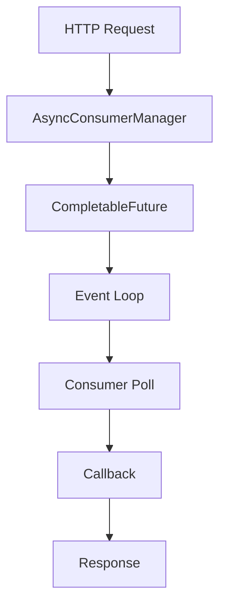

# RFC-0005: Async Consumer Operations

**Status:** Draft
**Author:** Codebase Analysis
**Created:** 2025-11-19
**Analysis Commit:** `28ae7f33556978fa8ee59bab75b27301d1222622`

## Summary

Refactor V2 consumer operations to use non-blocking async patterns, reducing thread usage and improving scalability.

## Motivation

Current consumer implementation blocks threads during polling:

```java
// KafkaConsumerManager.java
// https://github.com/confluentinc/kafka-rest/blob/28ae7f33556978fa8ee59bab75b27301d1222622/kafka-rest/src/main/java/io/confluent/kafkarest/v2/KafkaConsumerManager.java
private class RunnableReadTask implements Runnable {
  @Override
  public void run() {
    ConsumerRecords<byte[], byte[]> records = consumer.poll(Duration.ZERO);
    // Process records...
  }
}
```

**Problems:**

1. **Thread per consumer** - Each consumer instance uses a thread
2. **Blocking poll** - Even with `Duration.ZERO`, thread is occupied
3. **Limited scalability** - Default 50 threads caps concurrent consumers
4. **Lock contention** - Synchronized blocks on consumer map

**Example scenario:**
- 100 concurrent consumers
- Default 50 threads
- 50 consumers blocked, poor utilization

## Detailed Design

### Async Architecture



### Async Consumer Manager

```java
public class AsyncConsumerManager {

  private final ScheduledExecutorService scheduler;
  private final Map<ConsumerInstanceId, AsyncConsumerState> consumers;

  public CompletableFuture<List<ConsumerRecord<byte[], byte[]>>> readRecords(
      ConsumerInstanceId instanceId,
      Duration timeout) {

    AsyncConsumerState state = consumers.get(instanceId);
    if (state == null) {
      return CompletableFuture.failedFuture(
          new NotFoundException("Consumer not found"));
    }

    CompletableFuture<List<ConsumerRecord<byte[], byte[]>>> future =
        new CompletableFuture<>();

    // Schedule polling
    schedulePolling(state, future, timeout, Instant.now());

    return future;
  }

  private void schedulePolling(
      AsyncConsumerState state,
      CompletableFuture<List<ConsumerRecord<byte[], byte[]>>> future,
      Duration timeout,
      Instant startTime) {

    scheduler.schedule(() -> {
      try {
        // Non-blocking poll
        ConsumerRecords<byte[], byte[]> records = state.getConsumer()
            .poll(Duration.ZERO);

        if (!records.isEmpty()) {
          // Records available, complete the future
          future.complete(toList(records));
        } else if (Instant.now().isAfter(startTime.plus(timeout))) {
          // Timeout, return empty
          future.complete(Collections.emptyList());
        } else {
          // Reschedule polling
          schedulePolling(state, future, timeout, startTime);
        }
      } catch (Exception e) {
        future.completeExceptionally(e);
      }
    }, 10, TimeUnit.MILLISECONDS);  // Poll every 10ms
  }
}
```

### Resource Integration

```java
// ConsumersResource.java (V2)
@GET
@Path("/{instanceId}/records")
public void readRecords(
    @Suspended AsyncResponse asyncResponse,
    @PathParam("groupId") String groupId,
    @PathParam("instanceId") String instanceId,
    @QueryParam("timeout") @DefaultValue("5000") int timeout) {

  ConsumerInstanceId id = new ConsumerInstanceId(groupId, instanceId);

  asyncConsumerManager.readRecords(id, Duration.ofMillis(timeout))
      .thenApply(records -> records.stream()
          .map(this::toConsumerRecord)
          .collect(toList()))
      .thenApply(Response::ok)
      .whenComplete((builder, error) -> {
        if (error != null) {
          asyncResponse.resume(error);
        } else {
          asyncResponse.resume(builder.build());
        }
      });
}
```

### Scheduler Configuration

```java
// Single scheduler for all polling
ScheduledExecutorService scheduler = Executors.newScheduledThreadPool(
    Runtime.getRuntime().availableProcessors(),
    new ThreadFactoryBuilder()
        .setNameFormat("consumer-poll-%d")
        .setDaemon(true)
        .build());
```

### Configuration

```properties
# Enable async consumers
consumer.async.enabled=true

# Scheduler threads
consumer.async.scheduler.threads=8

# Polling interval
consumer.async.poll.interval.ms=10

# Maximum pending polls
consumer.async.max.pending.polls=1000
```

## Example Usage

### Before (Blocking)

```java
// Thread blocked during entire operation
executor.submit(new RunnableReadTask(consumer, callback));
// Thread occupied until callback completes
```

### After (Non-blocking)

```java
// Thread released immediately
CompletableFuture<List<ConsumerRecord<...>>> future =
    asyncConsumerManager.readRecords(instanceId, timeout);

// Callback scheduled when records available
future.thenAccept(records -> processRecords(records));
```

## Implementation Plan

### Phase 1: Core Async Manager (Week 1)

1. Create `AsyncConsumerManager`
2. Implement scheduled polling
3. Consumer state management

### Phase 2: Resource Integration (Week 2)

1. Update `ConsumersResource`
2. AsyncResponse handling
3. Error propagation

### Phase 3: Testing and Migration (Week 3)

1. Backward compatibility tests
2. Performance benchmarks
3. Migration path

## Backwards Compatibility

- **Default:** Current behavior preserved
- **Opt-in:** `consumer.async.enabled=true`
- **API:** No REST API changes

### Migration

```properties
# Phase 1: Test in staging
consumer.async.enabled=true

# Phase 2: Roll out to production
# Monitor thread usage and latency
```

## Alternatives Considered

### Alternative 1: Increase Thread Pool

Simply increase `consumer.threads`.

**Rejected because:**
- Linear memory increase
- Doesn't solve fundamental blocking issue
- Costly for many consumers

### Alternative 2: Reactive Streams

Use Project Reactor or RxJava.

**Rejected because:**
- Major API changes
- Learning curve
- Overkill for this use case

## Open Questions

1. **Ordering:** How to guarantee ordering with scheduled polls?
   - Proposal: Per-consumer poll scheduling, not concurrent

2. **Backpressure:** What if polls pile up?
   - Proposal: Max pending polls configuration

3. **Timeout accuracy:** Can we guarantee exact timeouts?
   - Proposal: Best-effort, document 10ms granularity

## Success Criteria

- [ ] 50% reduction in thread usage
- [ ] Same or better latency
- [ ] Support 200+ concurrent consumers
- [ ] No change in API behavior
- [ ] Backward compatible

## Effort Estimation

**Total:** 15 dev-days

| Task | Days |
|------|------|
| Design and review | 2 |
| Async manager implementation | 5 |
| Resource integration | 3 |
| Testing | 4 |
| Documentation | 1 |

## Required Approvals

- [ ] Architecture Review
